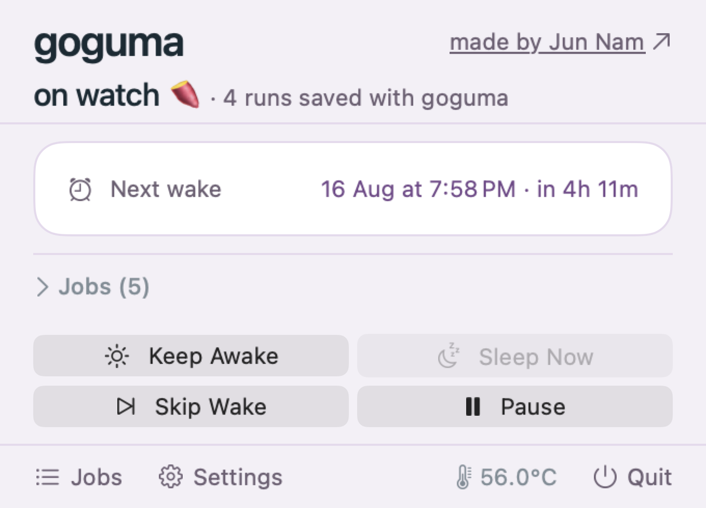
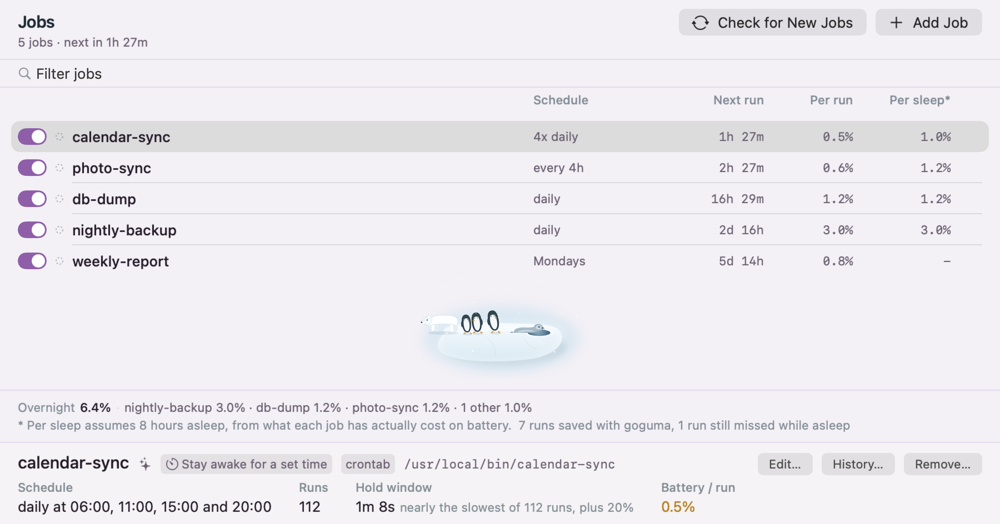
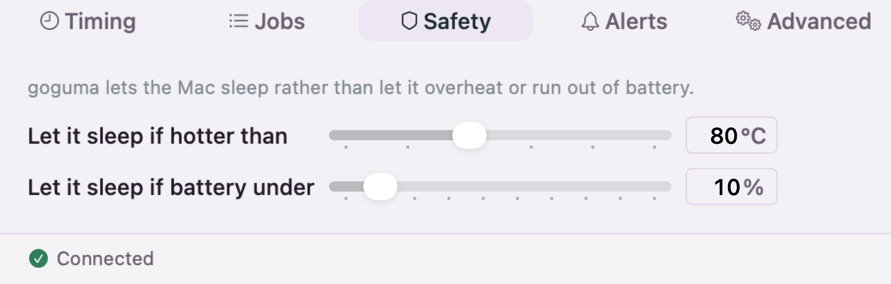

<div align="center">

# 🍠 goguma

**Wakes your machine for scheduled jobs, holds it awake<br>while long work finishes, and lets it sleep otherwise.**

[](LICENSE)


[getgoguma.com](https://getgoguma.com) ·
[Download](https://github.com/junnam586/goguma/releases/latest) ·
[Security](SECURITY.md) ·
[Coding agents](Docs/CODING-AGENTS.md) ·
[Architecture](Docs/ARCHITECTURE.md) ·
[Updates](https://getgoguma.com/updates)

</div>

## What it does

goguma wakes your machine shortly before each scheduled job, keeps it awake
while the job runs, and lets it sleep again as soon as the job is done.

goguma doesn't run your jobs; it makes sure the laptop is awake when they fire.

A sleeping machine doesn't queue the jobs it missed and catch up later. It
misses them outright. Nothing fails, nothing retries, and no error is written
anywhere, because as far as the scheduler is concerned nothing went wrong. You
find out weeks later, when you notice the digest you set up has been arriving
on some days and not others.

There is a second version of the same problem, and it is newer. Work that has
no schedule at all still takes as long as it takes: a coding agent chewing
through a refactor, a long build, a big sync. Close the lid and the machine
sleeps underneath it, and you come back to a session that stopped halfway.

```sh
goguma run -- claude -p "refactor the auth module"
```

Sleep is held off for exactly as long as that command runs, lid closed included,
then released. For an agent inside an editor, where there is no command to wrap,
goguma sets that up and keeps it that way: Claude Code, Codex and Cursor report
when they are working, and the machine stays awake until they stop. It is a
setting, so one switch turns it off again.

goguma fixes both. It lives in the menu bar: what is being held awake and what
for, when the next wake is and which job it is for, and how long each job has
been taking. Keep the Mac awake, skip the next wake, or pause everything
without ever opening a terminal window (Or use the CLI)!

[**Download goguma for macOS**](https://github.com/junnam586/goguma/releases/latest)

<div align="center">



</div>

## Features

- goguma finds the jobs and automations already scheduled on your machine. You
  don't have to do anything, goguma will find them on its own
- goguma reads app schedulers too, for apps that run jobs from inside
  themselves rather than through cron or launchd (`goguma scheduler add`)
- goguma tells you which of those jobs have been missing runs, and how often
- goguma wakes the machine right before each job fires, and sleeps again the
  moment it exits
- goguma learns how long each job takes, so the window fits the work instead of
  guessing
- goguma ends a hold early if the machine gets hot or the battery gets low
- goguma holds the machine awake for work that has no schedule at all, with
  `goguma run -- <command>`, for as long as that command takes and no longer
- goguma keeps a coding agent running with the lid shut, set up for you and
  kept that way, and stops the moment the agent does rather than on a timer
- goguma keeps the lid-closed case working, which `caffeinate` cannot do, so an
  agent or a build carries on after you shut the laptop
- goguma works on the menu bar app for macOS, so it is all visible without the
  terminal

## Installation

Requires macOS 14 or newer, or Linux with systemd.

### Download the app (recommended)

[**Download goguma for macOS**](https://github.com/junnam586/goguma/releases/latest),
drag it to Applications, and open it. It will offer to set itself up, and the
command line tools are inside the app, so this is the whole install.

### Or install the CLI only

```sh
brew install junnam586/tap/goguma
goguma install
```

Both paths end in the same place: a background service, a privileged helper and
the `goguma` command. The app is a viewer for that service, so adding it later
is just opening it, and removing it changes nothing about your jobs.

`goguma install` sets up the background service and the helper. The helper only blocks
sleep and schedules wakes; everything else runs unprivileged.

Also available as a release archive, via `go install`, or built from source
with `go build ./cmd/...`. The Mac app is a universal binary, so Intel and
Apple silicon run the same download; the command line archives are per
architecture and Homebrew picks the right one. Linux builds ship for amd64 and
arm64 and pass CI on every commit.

## Usage

You don't have to do this. goguma reads every scheduler on the machine by
itself, every couple of minutes, and starts waking for what it finds. Run
`goguma import` when you want to see what it found, or to give one of those
jobs exact timing:

<div align="center">


</div>

Adopted jobs are woken for either way. Where a job's process can be picked out
of the process table, goguma watches for it and sleeps the moment it exits.
Where it can't, the machine is held for a bounded window instead, which costs
a little more battery.

`goguma import --register` is how you close that gap. It offers to wrap the job
in `goguma-mark`, which reports the exact start, end and exit code. If you
accept, goguma makes that edit for you: it rewrites the crontab line or the
launchd plist, keeps a copy of the original, and puts the original back if the
result doesn't verify. Nothing is changed until you say yes to that job, and
`goguma import` on its own only reports.

Everything else is a click. The menu bar shows what is being held awake and
what is coming next, the jobs window lists everything with its learned duration
and lets you add, edit or pause a job, and settings covers the timing and
safety limits.

<div align="center">



</div>

Selecting a job shows where its numbers came from: the hold window underneath
is the figure goguma learned, not one you set, and it says which runs it was
derived from. The rest of this section is the same features for people who
would rather type.

```sh
goguma status    # see what goguma is doing
```

Add a job by hand with cron syntax or plain English:

```sh
goguma add --name nightly-backup --cron "every day at 3am" \
    --command "restic backup /home"
```

For exact timing, run the job through the included wrapper. It reports the
start, end, and exit code, so the machine sleeps the moment the job is done:

```
0 3 * * * goguma-mark nightly-backup -- restic backup /home
```

Some apps keep their own job list in a file rather than registering with cron
or launchd. Point goguma at that file once and it reads it from then on:

```sh
goguma scheduler add cowork ~/Library/Application\ Support/Cowork/tasks.json
```

`goguma help` lists all commands, and `goguma help <command>` explains one.

### Long jobs and coding agents

Everything above is about work with a schedule. For work without one, wrap it:

```sh
goguma run -- claude -p "refactor the auth module"
goguma run -- make -j8 release
goguma run --label nightly -- rsync -a ~/work backup:/work
```

Sleep is held off for exactly as long as the command runs and released when it
exits, so the window is the work rather than a guess. Output, input and exit
status pass straight through, which means this can go in front of anything
without changing what it does or what reads it.

**It keeps working with the lid shut**, which is the part `caffeinate` cannot
do: `caffeinate` holds off idle sleep and a closed lid is not idle sleep. goguma
goes through its helper for that.

An agent running inside an editor never gives you a command to wrap, and it
cannot be watched from outside either. The process is there whether or not it is
doing anything, and CPU does not separate the two, because an agent waiting on a
model is a process blocked on a socket. Measured across four agent processes over
ten seconds, the busiest figure belonged to an **idle** session and the one
actually working used less.

So the editor reports it instead, and goguma keeps that arranged for every
agent on the machine, including ones installed later. There is nothing to set up:

```sh
goguma hooks      # what is set up, and what isn't
```

Claude Code, Codex and Cursor are covered. Each session holds separately, so two
editors at once don't release each other, and the hold ends when the agent does
rather than on a timer. Your existing hooks are kept and a backup is written;
`goguma hooks remove` undoes it. [Docs/CODING-AGENTS.md](Docs/CODING-AGENTS.md)
has the detail.

The hold is leased, so a wrapper that is killed outright cannot strand it: it
lapses by itself rather than waiting for someone to notice. Nothing here is
recorded as a job run, and the machine still sleeps if it overheats or the
battery runs low, exactly as it does for a scheduled job.

## Safety

A hold is released early if the CPU goes above 80°C or the battery drops
below 10%, both configurable. So a laptop that is awake in a closed bag stops
heating up, and one on battery doesn't run out of charge.

<div align="center">



</div>

The 10% floor rises for jobs that are measured to cost more than that. A job
that has been drawing 4% per run won't start one below 14%, so it can't
strand the machine partway through.

If a job hangs, a time limit learned from its previous runs ends the hold. The
default backstop is five minutes.

When goguma wakes the machine itself, it puts it back to sleep afterwards. It
has to: macOS treats a scheduled wake as though you had opened the lid, so
everything else on the machine wakes up too and can keep it up for hours after
a job that took thirty seconds.

It only does this when it actually watched the job finish. That covers more
than it sounds: a job wrapped in `goguma-mark`, one whose process it can match,
and one whose own scheduler reports the run, which is how an adopted job with no
wrapper at all still qualifies.

What never qualifies is a window that closed without seeing anything, because
the job may still be running and sleeping the machine at the end of a guess
could suspend a backup mid-write. It also needs every hold closed and nobody at
the keyboard for two minutes. Turn it off with
`goguma config set sleep_after_wake off`.

goguma installs one small program that runs as root, because blocking sleep and
setting a wake alarm both need it. [SECURITY.md](SECURITY.md) says what that
program is allowed to do, who can reach it, and what the rest of it reads.

## FAQ

**Does goguma run my jobs?**
No. Whatever runs them now still runs them; goguma only makes sure the machine
is awake at the time.

**If I only install the app, does it find my jobs on its own?**
Yes. The background service re-reads every scheduler on the machine every couple of
minutes and wakes for whatever is worth waking for, with no terminal step. It
doesn't touch your crontab to do it, so a job whose process it can't recognise
gets a bounded window rather than exact timing. `goguma import --register` is
how you upgrade those, and `goguma sync` re-reads everything on demand.

**Does it ever edit my crontab?**
Only in one place, and only after you say yes to that specific job:
`goguma import --register`. It keeps a copy of the old crontab first and
restores it if the new one doesn't verify. Everything else reads and never
writes. See [Installing and removing it](SECURITY.md#installing-and-removing-it).

**What if I can't change a job's command?**
goguma can watch the process table for it instead (`--detection pattern
--match "restic.*backup"`), or hold the machine awake for a fixed window
(`--detection none`).

**Can I use this to keep an agent running with the lid closed?**
Yes, and it is set up for you. Claude Code, Codex and Cursor are configured to
report when they are working, so the machine stays awake until they finish and
sleeps once they do. It is a setting: `goguma config set agent_hooks off`, or
the switch in the app, takes it back out. `goguma hooks` shows what is in place and
`goguma hooks remove` undoes it. For anything you launch yourself, wrap it:
`goguma run -- <command>`.

**Does it keep the machine awake the whole time an editor is open?**
No. It holds while an agent is actually working and releases when that session
stops, not on a timer. A browser tab running a web agent needs nothing at all:
that work is on someone else's server, so your Mac sleeping doesn't interrupt
it.

**Isn't that just `caffeinate`?**
`caffeinate` holds off idle sleep, and a closed lid is not idle sleep, so it
stops the moment you shut the laptop. It also cannot wake a sleeping machine at
all, which is the other half of what goguma does.

**Why not just `sudo pmset -a disablesleep 1`?**
That is the mechanism goguma uses, and for one supervised run it is enough. It
is a global setting that survives the process exiting, logout and reboot, so
forgetting to clear it means the machine never sleeps again. goguma guarantees
the other half: released when the command exits, when the daemon dies, when the
battery hits 10%, and when the machine hits 80°C.

**Does anything leave my machine?**
Nothing about you. There is no account, no telemetry and no analytics.
[SECURITY.md](SECURITY.md#nothing-about-you-leaves-your-machine) lists the only
two pieces of code that can open a socket at all.

**Does it work on Linux?**
Yes, on a distribution with systemd. It uses `systemd-inhibit` to hold sleep
and `rtcwake` to set the alarm. Windows isn't supported.

**Where's the menu bar app?**
In the [release download](https://github.com/junnam586/goguma/releases/latest),
or build it yourself from [`macos/`](macos/README.md) by running
`cd macos && ./scripts/make-app.sh`.

**How do I hear when something breaks?**
[getgoguma.com/updates](https://getgoguma.com/updates).

**Where can I read more?**
Architecture notes are in [Docs/ARCHITECTURE.md](Docs/ARCHITECTURE.md), and the
Mac app has its own notes in [macos/README.md](macos/README.md).

## Who made this

My name is Juhyun (Jun) Nam. I'm a sophomore at Duke University, and I built
goguma because my own automations weren't running at night.

You can find me on
[LinkedIn](https://www.linkedin.com/in/jun-nam-4ba16b326/), and I'm happy to
answer any questions about goguma at
[junnam586@gmail.com](mailto:junnam586@gmail.com). If it's a security issue
rather than a question, [SECURITY.md](SECURITY.md#reporting-something) says how
to report it.

## License

[MIT](LICENSE)
